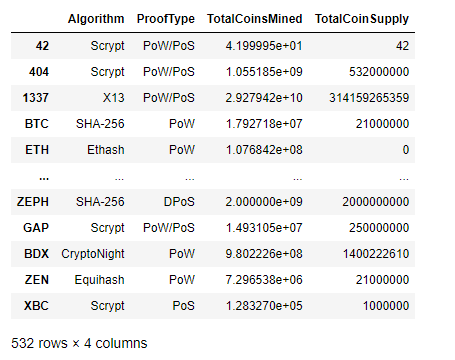
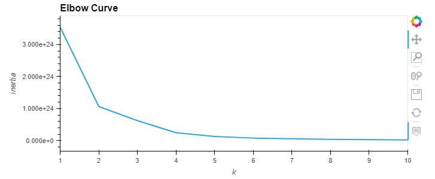
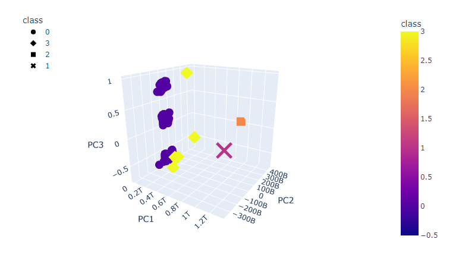
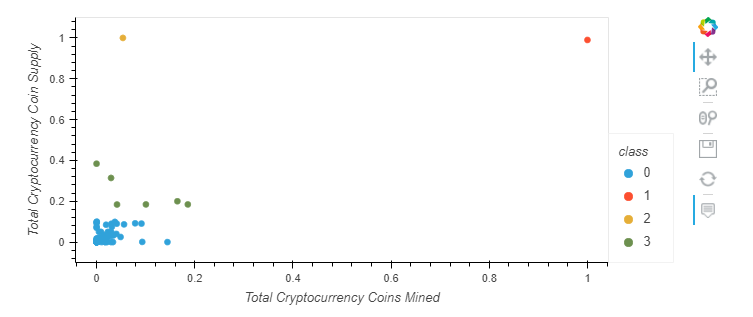

# Cryptocurrencies

## Overview of Project  

**Purpose:**  
The purpose of this project is to group cryptocurrencies using a clustering algoithm and create a data visualization to share our findings.  

## Resources:  
- Data Source: [Cryptocurrency data](https://min-api.cryptocompare.com/data/all/coinlist)  
- Software: Anaconda 4.10.3, Python 3.9.7, Jupyter Notebook 6.4.5, scikit-learn 0.24.2  

## Analysis and Results  

**Analysis:**  
The first thing I did with the dataset is performed ETL to clean and transform the data. I sorted the currently traded currencies and removed any null data values. Next, I manipulated the data into binary information, this step is important when using unsupervised machine learning. I standardized our data and reduced our dimensions into three principal components. By using an Elbow Curve, I was able to find the best value for "k" which is the number of clusters to group cryptocurrencies. I then created a 3D scatter plot of the cryptocurreny groupings based on the three principal components. As well as creating a 2D scatter plot of "Total Cryptocurrency Coins Mined" vs. "Total Cryptocurrency Coin Supply."  

**Results:**  
The data started with 1252 different cryptocurrencies with 6 different columns of information. After cleaning and transforming the dataset, there are 532 tradable cryptocurrencies that were currently being traded.  
  

Looking at the eblow curve, I determined that k=4 or 4 cluster groups is what I will use to group our data.  
  

Three principal components were created from reducing the data dimenions for plotting our 3D graph. We can see from our 3D graph, class 1, 2, and 3 have minimal data points compared to that of class 0.  
  

A 2D graph was also created displaying the relationship between "Total Coins Mined" vs. "Total Coin Supply".  
  

## Summary  

**Conclusion**  
From my analysis, it was concluded that there were minimal data points for classes 1, 2, and 3.  
- Class 1: BitTorrent  
- Class 2: TurtleCoin  
- Class 3: ByteCoin, EliteCoin, gCn Coin, MoonCoin, Newton Coin, Qwertycoin  

I would recommend further reviewing those data points for accuracy. It would be intresting to see how the graphs and cluster groupings would change with these data points removed.  

### Codes Used  

NEED to update
(Please look at specific files for codes used)  
Code for [analysis](https://github.com/tonywang3571/Cryptocurrencies/blob/master/crypto_clustering.ipynb)  
